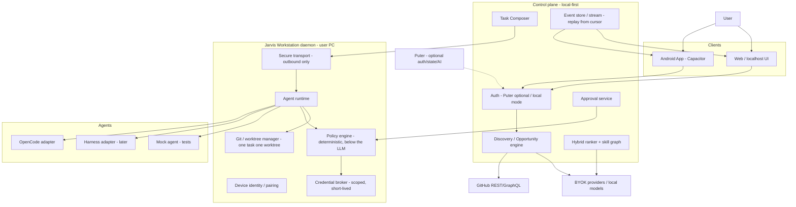

# docs/ARCHITECTURE.md — Jarvis system map

> Binding reference: `docs/source/JARVIS_PRODUCTION_BUILD_PROMPT.md` §5, §17–§30, §180–§181. This file is the repo-level summary; the contract wins on conflict until an ADR says otherwise.

## The four planes



## Monorepo layout (current, grows by week)

```text
jarvis/
├── apps/
│   ├── daemon/            # Jarvis Workstation (Node/TS; identity/transport/journal land WEEK-05+)
│   └── web/               # React+Vite UI (WEEK-08; Capacitor wraps it WEEK-09)
├── packages/
│   ├── protocol/          # ALL domain contracts (below)
│   ├── policy/            # deterministic rule engine + default safe ruleset
│   └── providers/         # AIProvider abstraction + adapters + routing
├── docs/                  # VISION, ARCHITECTURE (this), ROADMAP, source/*.md (the contract)
├── weeks/                 # WEEK-00..12 ladder + memory protocol + state/
├── doc-of-journey/        # daily log, ADRs, error/tactic catalogs
└── .github/workflows/     # CI
```

## What is in `@jarvis/protocol` (the spine)

Everything else depends on these contracts; nothing bypasses them:

- **IDs** — branded prefix ids (`usr_`, `task_`, `sess_`, `opp_`, `apr_`, `ws_`, `evt_` …)
- **Event envelope** — versioned (`event_version: 1`), sequenced, typed event names (contract §20), replayable by `sequence` cursor
- **Session state machine** — 16 states, validated transitions only (contract §19); CANCELLED reachable from active states (ADR 0003)
- **Task state machine + TaskContract** — versioned schema + human-readable markdown renderer (contract §16, §163)
- **Opportunity model** — 8 explicit kinds, swipe actions + rejection reasons, evidence records (contract §9, §10)
- **Approvals** — bind `action_hash` (SHA-256 over canonical JSON), `expires_at`; replay-proof by construction (contract §58, §123)
- **Policy types** — decision/rule/result shapes shared by engine and audit log (contract §117)
- **AgentGateway + AgentAdapter + JarvisSession** — provider-neutral agent control; OpenCode session ids are never the identity (contract §17, §18.2)
- **Workstation handshake** — `jarvis-workstation/1.0`, capability negotiation (contract §106–§108)

## Data flow: swipe → PR (happy path)

1. Discovery pulls candidates (GitHub APIs) → cheap filters → skill match → deep AI analysis only for promising candidates → dedup/validation → evidence assembly → ranked feed.
2. Swipe right → task contract composed → user picks workstation + agent + policy level.
3. Workstation preflight (repo, runtime, agent, disk, policy) → isolated worktree `jarvis/<task-id>-<slug>`.
4. Agent session created (JarvisSession wrapper) → events streamed, journaled, sequenced.
5. Policy engine gates every consequential action: ALLOW / APPROVAL_REQUIRED / DENY — deterministic, explainable.
6. Approval → bound to action hash → executed once → audit journaled.
7. Phone offline at any point: workstation continues; on reconnect, client replays events from its cursor (or takes a session snapshot on history gap).

## Deliberate non-choices (until an ADR says otherwise)

- **No database yet.** The workstation journal starts as append-only JSONL (WEEK-05); SQLite/migrations arrive when queries need them (WEEK-10+ candidate).
- **No cloud control plane.** The control plane is local-first; Puter state sync is an optional client-side layer (WEEK-08), never a dependency.
- **No Hermes runtime.** OpenCode control is ours (`packages/agents` lands WEEK-06), Hermes is pattern reference only.
