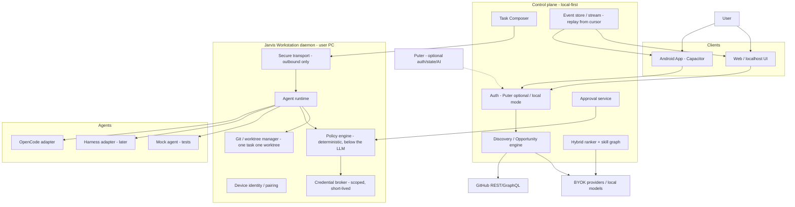

# docs/ARCHITECTURE.md — Jarvis system map

> Binding reference: `docs/source/JARVIS_PRODUCTION_BUILD_PROMPT.md` §5, §17–§30, §180–§181. This file is the repo-level summary; the contract wins on conflict until an ADR says otherwise.

## The four planes


```mermaid
flowchart TB
    U[User]

    subgraph Clients
        A[Android App - Capacitor]
        W[Web / localhost UI]
    end

    subgraph Control[Control plane - local-first]
        AUTH[Auth - Puter optional / local mode]
        DISC[Discovery / Opportunity engine]
        RANK[Hybrid ranker + skill graph]
        TC[Task Composer]
        EV[Event store / stream - replay from cursor]
        APR[Approval service]
    end

    subgraph WS[Jarvis Workstation daemon - user PC]
        ID[Device identity / pairing]
        TR[Secure transport - outbound only]
        POL[Policy engine - deterministic, below the LLM]
        SEC[Credential broker - scoped, short-lived]
        RT[Agent runtime]
        GT[Git / worktree manager - one task one worktree]
    end

    subgraph Agents
        OC[OpenCode adapter]
        HA[Harness adapter - later]
        MOCK[Mock agent - tests]
    end

    GH[GitHub REST/GraphQL]
    PROV[BYOK providers / local models]
    PUTER[Puter - optional auth/state/AI]

    U --> A & W
    A & W --> AUTH --> DISC
    DISC --> GH
    DISC & RANK --> PROV
    TC --> TR --> RT
    RT --> OC & HA & MOCK
    RT --> POL --> SEC
    RT --> GT
    EV --> A & W
    APR --> POL
    PUTER -.-> AUTH
```

## Monorepo layout (current, grows by week)

```text
jarvis/
├── apps/
│   ├── daemon/            # GitSwipe Workstation (Node/TS): serve/pair/devices + workstation/{config,identity,pairing,journal,queue,health,server} + demo server
│   └── web/               # React+Vite UI (on mvp branch now; merges to dev in WEEK-08; Capacitor wraps it WEEK-09)
├── packages/
│   ├── protocol/         # ALL domain contracts (below)
│   ├── policy/            # deterministic rule engine + default safe ruleset + path sandbox
│   ├── providers/         # AIProvider abstraction + adapters + routing + secret store + failover
│   ├── github/            # REST client (pagination/ETag/backoff/rate-budget) + PAT auth + normalized entities + JSONL candidate store + checkIssueState
│   ├── discovery/         # candidates + swipes + skill graph + ranker + dedup + findings + references + radar + prompts
│   ├── agents/            # AgentGateway + MockAgentAdapter + OpenCodeAdapter (dispatch conventions) + worktree manager + checkpoints
│   └── security/         # ExecutionGate + CredentialBroker + AuditJournal + redaction (wired into WorkstationJournal)
├── gitresearch.md         # standing external-repo research index
├── docs/                  # VISION, ARCHITECTURE (this), ROADMAP, REPO-WORK-CONVENTIONS, MVP-PLAN, source/*.md (the contract)
├── weeks/                 # WEEK-00..12 ladder + memory protocol + state/
├── doc-of-journey/        # daily log, ADRs 0001–0008, error/tactic catalogs
└── .github/workflows/     # CI (test + typecheck on every branch)
```

## What is in `@jarvis/protocol` (the spine)

Everything else depends on these contracts; nothing bypasses them:

- **IDs** — branded prefix ids (`usr_`, `task_`, `sess_`, `opp_`, `apr_`, `ws_`, `evt_` …)
- **Event envelope** — versioned (`event_version: 1`), sequenced, typed event names (contract §20), replayable by `sequence` cursor
- **Session state machine** — 16 states, validated transitions only (contract §19); CANCELLED reachable from active states (ADR 0003)
- **Task state machine + TaskContract** — versioned schema + human-readable markdown renderer (contract §16, §163)
- **Opportunity model** — 8 explicit kinds, swipe actions + rejection reasons, evidence records (contract §9, §10)
- **Approvals** — bind `action_hash` (SHA-256 over canonical JSON), `expires_at`; replay-proof by construction; **two distinct authorizations**: `verifyApprovalBinding` (decision: pending→granted/denied) and `verifyGrantedApproval` (execution: granted-only, binds actor/session/task/policy-version per §58, explicit `consumed` state); failed executions also consume (contract §58, §123, §162)
- **Policy types** — decision/rule/result shapes shared by engine and audit log (contract §117)
- **AgentGateway + AgentAdapter + JarvisSession** — provider-neutral agent control; OpenCode session ids are never the identity (contract §17, §18.2)
- **Workstation handshake** — `jarvis-workstation/1.0`, capability negotiation (contract §106–§108)

## Data flow: swipe → PR (happy path)

1. Discovery pulls candidates (GitHub APIs) → cheap filters → skill match → deep AI analysis only for promising candidates → dedup/validation → evidence assembly → ranked feed.
2. Swipe right → task contract composed → user picks workstation + agent + policy level.
3. Workstation preflight (repo, runtime, agent, disk, policy) → isolated worktree `jarvis/<task-id>-<slug>`.
4. Agent session created (JarvisSession wrapper) → events streamed, journaled, sequenced.
5. Policy engine gates every consequential action: ALLOW / APPROVAL_REQUIRED / DENY — deterministic, explainable.
6. Approval → bound to action hash → executed once → audit journaled.
7. Phone offline at any point: workstation continues; on reconnect, client replays events from its cursor (or takes a session snapshot on history gap).

## Deliberate non-choices (until an ADR says otherwise)

- **No database yet.** The workstation journal, audit journal, task queue, candidate store, swipe store, and checkpoints are all append-only JSONL; SQLite/migrations arrive when queries need them (WEEK-10+ candidate). 168 tests pass with zero DB dependencies.
- **No cloud control plane.** The control plane is local-first; Puter state sync is an optional client-side layer (WEEK-08), never a dependency.
- **No Hermes runtime.** OpenCode control is ours (`@jarvis/agents`), Hermes is pattern reference only.
- **No multi-agent framework.** GitSwipe dispatches to coding agents; it does not orchestrate agent graphs. Adding one is contract §178.20 territory.
- **No LiteLLM dependency.** Already supported via the OpenAI-compatible provider's base URL — a user self-hosting LiteLLM gets multi-provider routing for free (gitresearch.md verdict).
- **No semgrep dependency (yet).** Parked as a WEEK-11 optional capability: CI security scan + ExecutionGate diff-scanning gate (SUGGESTIONS.md).
